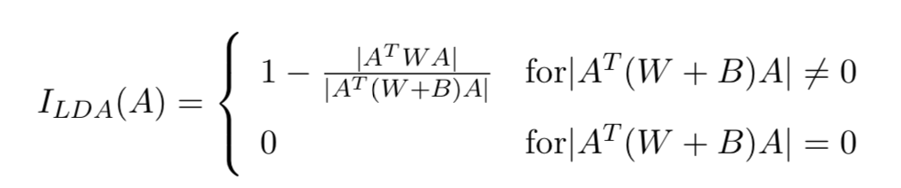
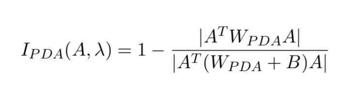
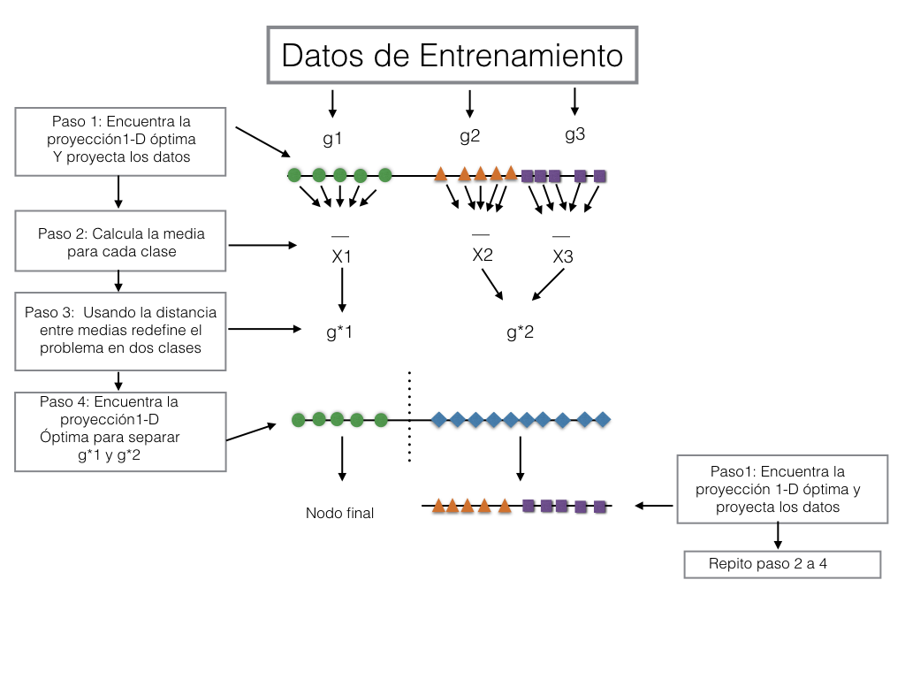
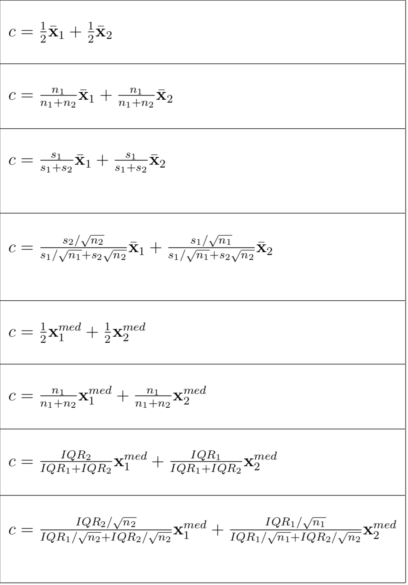
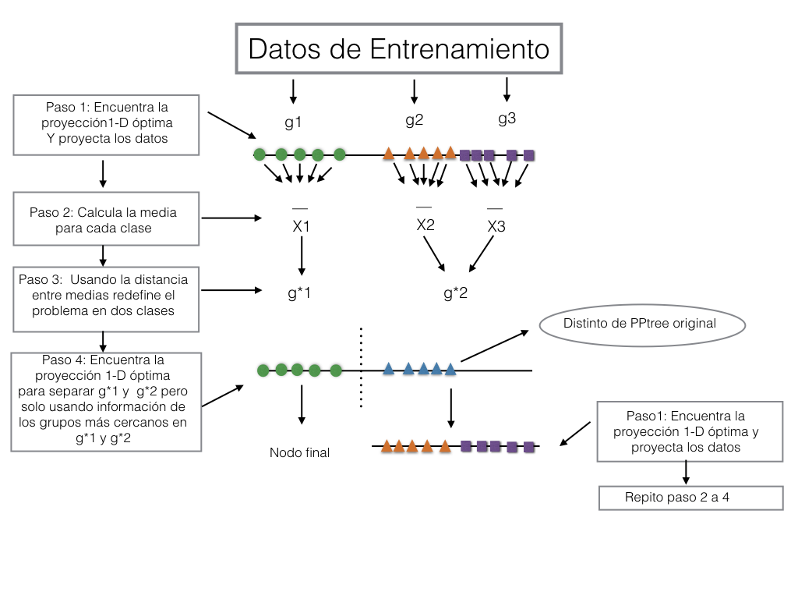
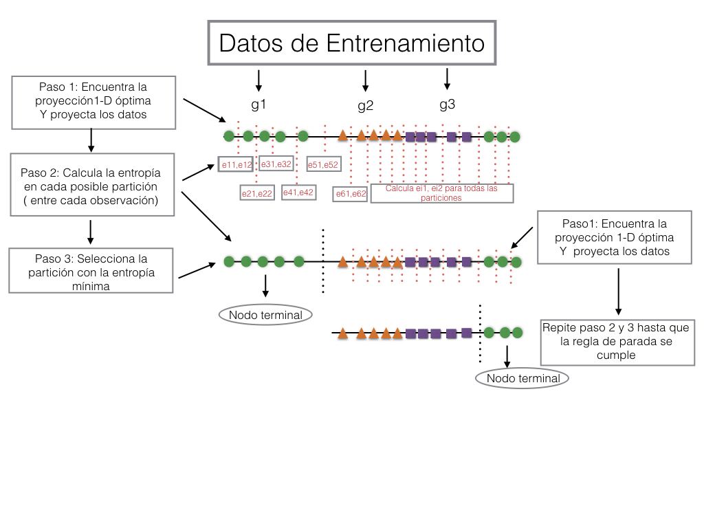

 <style>
 .title-slide {
     background-image: url(paint1.png);
     background-repeat: no-repeat;
     padding:40px;
     background-size: 1000px 800px;
   }
   </style>
```{r setup, include=FALSE}
knitr::opts_chunk$set(echo = FALSE)
```

## <span style="color:#26734d"> Presentación</span>

Disponible en:https://natydasilva.github.io/PPtreeExtupdate/#1

Link en el repositorio de SIESTA: https://github.com/natydasilva/SIESTA


## <span style="color:#26734d"> Estructura de la charla</span> 

- Motivación

- Projection Pursuit

- Descripción de PPtree

- Aspectos menos deseables de PPtree

- Extensiones de PPtree

- Comentarios Finales

## <span style="color:#26734d"> Motivación</span>

- Trabajo de PhD en bosques basados en proyecciones (Projection pursuit RF).

- Clasificador individual PPtree.

- Mejorar la performance de bosques mejorando los árboles individuales.

## <span style="color:#26734d"> Projection Pursuit</span>

- PP es una técnica estadística para exploración para encontrar proyecciones de datos que revelen estructuras interesantes [@friedman1973projection].

- Los algoritmos de PP buscan proyecciones de bajas dimensiones optimizando un índice de proyección que mide si la  proyección es útil en algún sentido. 

- Pocos PP índices incorporan información de las clases para el cálculo.

- [@lee2005projection] proponen un índice derivado del análisis disciminante lineal útil para exploración en clasificación supervisada.


## <span style="color:#26734d"> PP_LDA </span>



$B$ es la suma de cuadrados entre grupos, $W$ es la suma de cuadrados al interior del grupo y $A$ es una matríz de proyección. Cuando es pequeño esperamos pequeñas diferencias entre clases.


## <span style="color:#26734d"> PP_PDA </span>



$B^s$ suma de cuadrados entre grupos con los datos estandarizados, $W^s$ 
es la suma de cuadrados al interior del grupo con los datos estandarizados y $\lambda \in [0,1)$. Para problema $p$ grande $n$ pequeño.

## <span style="color:#26734d"> Projection pursuit </span>
- PP quiere encontrar todas las proyecciones interesantes.

- No solamente un óptimo global ya que los optimos locales pueden revelear estucturas interesantes.


## <span style="color:#26734d">PPtree</span>  
- **PPtree** [@lee2005projection] son árboles de clasificación basados en proyecciones.

- Combina métodos de árboles con reducción de dimensionalidad basada en proyecciones.

- Las particiones en  **PPtree** se basan en combinaciones lineales de variables por lo que toma en cuenta la correlación entre las variables para separar las clases.

## <span style="color:#26734d"> PPtree  </span> 

- Trata los datos siempre como un problema de dos clases.

- Cuando las clases son más de dos el algoritmo usas dos pasos de proyección optimizando un índice de proyección en cada partición del nodo.

- Los coeficientes de proyección en cada nodo representan la importancia de la variables, útiles para explorar como las clases son separadas en cada árbol.

## <span style="color:#26734d"> Algoritmo de PPtree</span> 
1. Optimiza un indice de proyección para encontrar una proyección $1-D$ óptima, $\alpha^*$, para separarar todas las classes obteniendo los datos proyectados $z = \alpha^*x$
<!-- Optimize a projection pursuit index to find an optimal one-dimensional projection, $\alpha^*$, for separating all classes in the current data yielding projected data $z = \alpha^*x$. -->
2. En $z$, dedefine el problema en uno de dos clases comparando medias y asigna una nueva etiqueta,  $g_1^*$ o $g_2^*$ para cada observación, generando una nueva variable $y_i^*$ para la clase.  
<!-- The new groups $g_1^*$ and $g_2^*$ can contain more than one original class. -->
<!-- On the projected data, $z$, redefine the problem into a two class problem by comparing means, and assign a new label, either $g_1^*$ or $g_2^*$ to each observation, generating a new class variable $y_i^*$.  The new groups $g_1^*$ and $g_2^*$ can contain more than one original class. -->
3. Encuentra una proyección $1-D$ óptima $\alpha^{**}$, usando $\{(\mathbf{x_i},y_i^*)\}_{i=1}^n$ para separar $g_1^*$ y $g_2^*$. La mejor separación y la regla de decisión para el nodo, si $\alpha^{**T}M_1< c$ entonces asigna $g_1^*$ al nodo izquierdo y en otro caso $g_2^*$ al derecho, donde $M_1$ es la media de $g_1^*$.

4. Para cada grupo, todos los pasos previos son repetidos hasta que  $g_1^*$ y $g_2^*$ tienen una sola clase de la clase original. 


## <span style="color:#26734d"> Ilustración del algoritmo </span> 



La profundidad del PPtree es como mucho el número de clases.
 
## <span style="color:#26734d"> PPtree, 8 reglas de corte </span> 


## <span style="color:#26734d">Aspectos menos deseables: I </span>
```{r libs, echo = FALSE, warning = FALSE, message=FALSE,fig.align="center"}
library(MASS)
library(ggplot2)
library(RColorBrewer)
library(PPtreeViz)
library(gridExtra)
library(reshape2)
library(PPforest)
library(plyr)
library(plotly)
library(dplyr)
library(GGally)
library(tidyr)

```

```{r, echo = FALSE, fig.height = 4, fig.width = 7,  warning = FALSE, message=FALSE }
simu3 <- function(mux1, mux2, muy1, muy2, muz1, muz2,  cor1,cor2,cor3, n1 = 100, n2 = 100, n3 = 100) {
  set.seed(666)
  bivn <- mvrnorm(n1, mu = c(mux1, mux2), Sigma = matrix(c(1, cor1, cor1, 1), 2))
  bivn2 <- mvrnorm(n2, mu = c(muy1, muy2), Sigma = matrix(c(1, cor2, cor2, 1), 2))
  bivn3 <- mvrnorm(n3, mu = c(muz1, muz2), Sigma = matrix(c(1, cor3, cor3, 1), 2))

  d1 <-data.frame(Sim = as.factor("sim1"), bivn)
  d2 <- data.frame(Sim = as.factor("sim2"), bivn2)
  d3 <- data.frame(Sim = as.factor("sim3"), bivn3)
  rbind(d1, d2, d3)
}

ppbound <- function(ru, data , meth, entro, title) {
  grilla <- base::expand.grid(X1 = seq((min(data$X1) + sign( min(data$X1))*.5) , (max(data$X1) + sign(max(data$X1))*.5), , 100),
                              X2 = seq((min(data$X2 ) + sign( min(data$X2))*.5), (max(data$X2) + sign(max(data$X2))*.5), , 100))

  if (meth == "Original"){
  pptree <- PPtreeViz::PPTreeclass(Sim ~ ., data = data, "LDA")
  ppred.sim <- PPtreeViz::PPclassify(pptree, test.data = grilla, Rule = ru)
  grilla$pred <- ppred.sim[[2]]
  err <- round(PPtreeViz::PPclassify(pptree, test.data = data[, -1], true.class = data[, 1], Rule = ru)[[1]] /
  nrow(data[, -1]), 3 ) * 100
  }

  if (meth == "Rpart"){
  rpart.mod <- rpart::rpart(Sim ~ ., data = data)
  grilla$pred <-
  predict(rpart.mod, newdata = grilla, type = "class")
  err <- round(1 - sum(diag(table(
  predict(rpart.mod, newdata = data[, -1], type = "class") , data[, 1]))) / nrow(data[, -1]), 3) * 100
  }

  if (entro) {
  mod = 2
  } else{
  mod = 1
  }

  if (meth == "Modified") {
  pptree <- PPtree_splitMOD(Sim ~ ., data = data, "LDA", entro = entro)
  ppred.sim <- PPtreeViz::PPclassify(pptree, test.data = grilla, Rule = ru)
  grilla$pred <- paste("sim", ppred.sim[[2]], sep = "")
  err <- round( PPtreeViz::PPclassify(pptree, test.data = data[, -1], true.class = data[, 1], Rule = ru)[[1]] /
  nrow(data[, -1]),3)*100
  }

  p <- ggplot2::ggplot(data = grilla) + ggplot2::geom_point(ggplot2::aes(x = X1,
  y = X2, color = as.factor(pred), shape = as.factor(pred) ), alpha = .20) +
  ggplot2::scale_colour_brewer(name = "Class", type = "qual",
  palette = "Dark2") + ggplot2::theme_bw() +
  ggplot2::scale_shape_discrete(name = 'Class')

  pl.pp <-
  p + ggplot2::geom_point( data = data, ggplot2::aes( x = X1 ,y = X2,
  group = Sim, shape = Sim, color = Sim ), size = I(3)) +
  ggplot2::theme(legend.position = "none", aspect.ratio = 1) +
  ggplot2::scale_y_continuous(expand = c(0, 0)) + ggplot2::scale_x_continuous(expand = c(0, 0)) +
  ggplot2::labs(x = " ", y = "",title = paste(title,"error",err,"%" ))

  pl.pp
}

ppboundMOD <-function(data, meth="MOD", entro = FALSE, entroindiv = TRUE, title ){
  grilla <- base::expand.grid(X1 = seq((min(data$X1) + sign( min(data$X1))*.5) , (max(data$X1) + sign(max(data$X1))*.5),, 100),
                              X2 = seq((min(data$X2 ) + sign( min(data$X2))*.5), (max(data$X2) + sign(max(data$X2))*.5),, 100))


  pptree <- PPTreeclass_MOD(Sim~. ,  data = data, PPmethod = 'LDA')

  ppred.sim <- PPclassify_MOD(pptree, test.data = grilla)
  grilla$ppred <-ppred.sim[[2]]
  err <- round(PPclassify_MOD(pptree, test.data=data[,-1], true.class = data[,1])[[1]]/nrow(data[,-1]),3)*100


  p <- ggplot2::ggplot(data = grilla ) + ggplot2::geom_point( ggplot2::aes(x = X1, y = X2, color = ppred, shape = ppred ), alpha = .20) +
  ggplot2::scale_colour_brewer(name = "Class",type = "qual", palette = "Dark2" ) + ggplot2::theme_bw() +
 ggplot2::scale_shape_discrete(name='Class')


    pl.pp <- p + ggplot2::geom_point(data = data, ggplot2::aes(x = X1 , y = X2, group = Sim, shape = Sim, color = Sim), size = I(3)  ) +
      ggplot2::theme(legend.position = "none",aspect.ratio = 1) +
      ggplot2::scale_y_continuous(expand = c(0, 0) ) + ggplot2::scale_x_continuous(expand = c(0, 0)) +
      ggplot2::labs(x = " ", y = "", title = paste(title,"error",err,"%" ))

  pl.pp
}


dat.pl2 <- simu3(-1,0.6,0,-0.6, 2,-1,0.95, 0.95, 0.95, 100, 100, 100)

gridExtra::grid.arrange( ppbound(ru =1,  data = dat.pl2, meth = "Rpart" , entro = FALSE, title = "Rpart " ),
                               ppbound(ru =  1, data = dat.pl2, meth = "Original", entro = TRUE, title ="PPtree" ), ncol = 2)

```

PPtree define una banda entre el naranja y el violeta que es muy cercana al grupo ya que la primer partición usa información del naranja y verde para calcular la media que define el punto de corte.


## <span style="color:#26734d">Aspectos menos deseables: II</span>


```{r, echo = FALSE, fig.height = 4, fig.width = 7, warning = FALSE, message=FALSE,fig.align="center", strip.white=TRUE }
#dat.pl2 <- simu3(-1, 0.6, 0, 0, 2,-1,0.95, 0.95, 0, 100, 100, 100)
dat.pl2 <- simu3(-1,0.6,0,-0.6, 2,-1,0.95, 0.95, 0.95, 100, 100, 100)

       set.seed(123)
       aux <- data.frame(Sim = rep(paste("sim",2,sep=""), 100), X1 = stats::rnorm( n = 100, mean = 0, sd = .5), X2 = stats::rnorm( n = 100, mean = 5, sd = .5))
      dat.pl2 <- rbind(dat.pl2, aux)

 gridExtra::grid.arrange( ppbound(ru =1,  data = dat.pl2, meth = "Rpart" , entro = FALSE, title ="Rpart" ),
                               ppbound(ru =  1, data = dat.pl2, meth = "Original", entro = TRUE, title="PPtree" ), ncol = 2)


```
Los naranjas no pueden separarse por una única partición lineal y PPtree no puede modelar esto porque una clase es asignada solamente a un nodo terminal.


## <span style="color:#26734d">Extensión: PPtree </span>

Hay dos formas que el algoritmo ha sido modificado:

* Regla de decisión.
* Permitiendo particiones múltiples por grupos.

- Subdividir super-clase para producir valor de corte más apropiado.

- Para incrementar el número de particiones por grupos, reglas de parada adicional tienen que ser definidas.

## <span style="color:#26734d">Extensión I: subdividiendo clases para producir mejores bandas</span>

-   La primer modificación se enfoca en el cuarto paso del algoritmo original. 

- En vez de combinar clases en una super clase, unicamente las dos clases más cercanas son usadas para determinar la partición.

<!-- , as measured by mean difference, are used to determine the new projection, and the split. -->


<!-- 4. Find an optimal one-dimensional projection $\alpha^{**}$, using a subset from $\{(\mathbf{x_i},y_i^*)\}_{i=1}^n$ to separate the two class problem $g_1^*$ and $g_2^*$. To this second projection \textbf{only information from the two closest groups} one from $g_1^*$ and the other from $g_2^*$ are used. -->
<!-- The best separation of $g_1^*$ and $g_2^*$ is determine in this step and the decision rule is defined for the current node, if $\alpha^{**T} \bar X_1< c$ then assign $g_1^*$ to the left node else assign $g_2^*$ to the right node, where $\bar X_1$ is the mean of $g_1^*$. -->


## <span style="color:#26734d"> PPtree extensión I</span> 



## <span style="color:#26734d">  Extensión II: permitiendo particiones múltiples por grupos </span>


- La modificación introduce una nueva forma de seleccionar el valor de la partición basado en la impureza del grupo resultante.

- $E(s)=-\sum_{j=1}^G p_{js}log(p_{js})$ donde $p_{js}$ es la proporción de puntos de la clase $j$ en el subconjunto $s$ y $G$ el número de clases.

- $E(s)$ grande indican grupos mezclados, impuros.

- $E(s)=0$ grupo puro.


## <span style="color:#26734d">  PPtree extension II </span>
- Para determinar la calidad de la partición se debe considerar el lado izquierdo y derecho de la partición.

- $E(s_L, s_R) = \frac{n_L}{n_L+n_R}E(s_L)+\frac{n_R}{n_L+n_R}E(s_R)$

- $E(s_L, s_R)$ se calcula para cada posible partición y la que tiene la mínima impureza determina $c$ el corte.

- Esta modificación cambia dramáticamente el algoritmo de PPtree con el objetivo de flexibilizarlo a clasificador no lineal permitiendo muchas particiones por clase.

- Necesitamos determinar reglas de parada.


## <span style="color:#26734d">  PPtree extension II </span>

1. Optimiza un índice de proyección para encontr la proyección $1-D$ óptima $\alpha^*$ para separar todas las clases en los datos.

2. Con los datos proyectados calcula la entropía para cada posible particción. Las posibles particiones son definidas entre cada valor proyectado.

3. Selecciona la mejor partición que minimiza $E(s_L, s_R)$.

4. Repite los pasos anteriores hasta que la regla de parada se satisface.


## <span style="color:#26734d"> PPtree extensión II regla de parada</span> 
La regla de parada controla cuando el crecimiento del árbol debe parar.
Las siguientes reglas de parada son usadas:

* Si un nodo es puro; todos los casos son de la misma clase en un nodo.
* Si el tamaño del nodo es menos que un valor menor a un valor determinado $n_S$.
* Si la reducción de la entropía de una partición es menos que un valor especificado $ent_s$.


## <span style="color:#26734d">Ilustración de la extensión II</span>



## <span style="color:#26734d">Comparación de algoritmos</span>

- Comparamos los métodos usando shiny [@chang11shiny] que nos permite incluir datos simulados y definir las bandas de cada algoritmo de forma interactiva.

- Se incluyen distintos métodos para simular datos 2D y las bandas definidad por los distintos algoritmos se muestra.
 
## <span style="color:#26734d">Comparación de algoritmos</span>

- Hay tres pestañas que  controlan los distintos tipos de datos simulados.

- 1 mixtura multivariada con igual matriz de var-cov para los grupos y diff media.

- Incluye un grupo con outliers.

- Simulación de mixturas con el paquete `MixSim`.


## <span style="color:#26734d">Panel 1:  Simulación básica de 3 clases</span>
<iframe src="https://player.vimeo.com/video/222613204" width="640" height="400" frameborder="0" webkitallowfullscreen mozallowfullscreen allowfullscreen></iframe>

## <span style="color:#26734d">Panel 2: Simulación con Outliers</span>
<iframe src="https://player.vimeo.com/video/222613230" width="640" height="400" frameborder="0" webkitallowfullscreen mozallowfullscreen allowfullscreen></iframe>

## <span style="color:#26734d">Panel 3: Simulaciones con  MixSim pkg</span>
<iframe src="https://player.vimeo.com/video/222613251" width="640" height="400" frameborder="0" webkitallowfullscreen mozallowfullscreen allowfullscreen></iframe>


## <span style="color:#26734d">Paquete PPtreeExt</span>

- Paquete en R PPtreeExt en etapa de desarrollo

- Disponible en https://github.com/natydasilva/PPtreeExt

- Deseable incluirlo en el paquete PPtree disponible en CRAN 

## <span style="color:#26734d">Comentarios Finales</span>

* Se presentaron dos posibles modificaciones en el algoritmo de PPTree para hacerlo más flexible. 

* Se examinaron las modificaciones mediante una shiny app. 

* Los resultados primarios muestran un algoritmo de clasificación más flexibles utilizando combinaciones de variables. 

* The shiny ilustra la simplicidad de constuir una herramienta para explorar resultados primarios en la modificacioón del algoritmo

* Implementado en un paquete en R.

## <span style="color:#26734d">Trabajo futuro</span>

- Comparar la performance de PPtree con sus posibles extensiones con datos simulados y reales

- Con los nuevos árboles extender PPforest

- ....


## <span style="color:#26734d"></span>


<!-- The new tree algorithm will be incorporated into the projection pursuit forest  classifier\citep{dasilvappforest}. With the implicit variable selection, nuisance variables should be better handled than is possibl with a single tree. Bagging will provide better, and more robust, fitting to nonlinear problems.  -->
